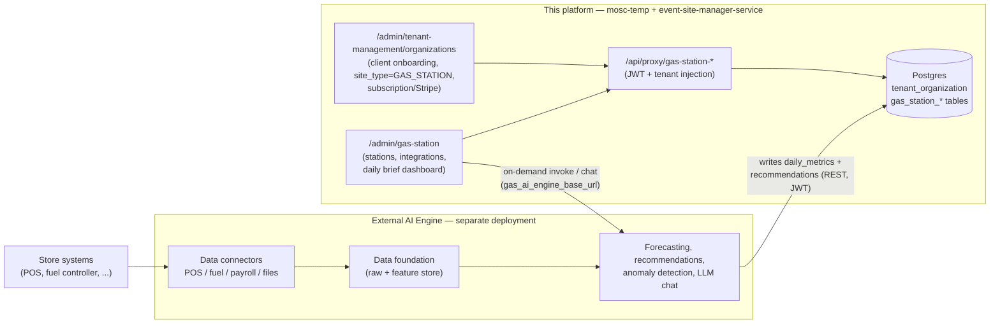

# Gas Station AI COO — Site Type Feasibility & Integration Plan

**Source concept:** `E:\Categories\Categories\Software_Projects\Gas_Station_AI` (AI Gas Station COO blueprint — a B2B SaaS "AI Chief Operating Officer" for convenience stores & fuel retailers that delivers a prescriptive morning action list with dollar impact per item).

**Question assessed:** Can gas-station clients be onboarded as tenants in this platform (via `/admin/tenant-management/organizations` + tenant settings), with the client management, billing, and daily dashboard UI maintained here, while the AI/LLM engine is deployed and invoked separately?

---

## 1. Verdict: Feasible — integrate as a `GAS_STATION` site type here; keep the AI engine as a separate service

The split the concept proposes maps cleanly onto architecture this platform already has:

| Concern | Where it lives | Why it fits |
|---|---|---|
| Client (store owner / chain) onboarding | `tenant_organization` (one tenant per paying customer) | Tenant CRM, contact, address, `is_active` already exist |
| Subscription billing ($199–$499/mo small owner, chain tiers) | `tenant_organization.subscription_plan`, `subscription_status`, `monthly_fee_usd`, `stripe_customer_id` | Stripe + subscription fields already on the org row — matches the blueprint's pricing model with **zero schema change** |
| Product identity | `tenant_organization.site_type = 'GAS_STATION'` | Extends the two-layer site-type design already in flight (`EVENT_ORG`, `PERSONAL_PROFILE`, `HYBRID`, …) |
| Homepage layout | `tenant_settings` boolean flags | `GAS_STATION` preset simply turns all public event/profile sections **off** — no new flags needed; the product surface is the admin dashboard, not the public homepage |
| Stores, integrations metadata, daily metrics, recommendations | **New tables** (this doc, section 4) | Same tenant-scoped CRUD pattern as profile/writings tables |
| Daily dashboard UI | New `/admin/gas-station` module | Same pattern as `/admin/profile-site`: proxy routes + `ApiServerActions.ts` + admin hub tile |
| Data connectors, forecasting, anomaly detection, LLM chat | **External AI engine** (separate deployment) | Invoked from here via configured endpoint; writes curated results back through the backend REST API |

**One tenant = one paying customer (owner or chain), not one store.** A tenant owns 1..N `gas_station_location` rows. This supports both the single-store owner (63% of the market per the blueprint) and the 5–20 store chain tier without changing the tenancy model.

### What this platform is a good fit for

- Tenant/client lifecycle: onboarding, activation, subscription, contact management — already built.
- Multi-tenant isolation by `tenant_id` with JWT-authenticated proxy layer — already built.
- Admin dashboard UX patterns (CRUD lists, forms, analytics pages like `check-in-analytics`, `sales-analytics`) — directly reusable for a daily-brief dashboard.
- WhatsApp/Twilio + email marketing plumbing in `tenant_settings` — reusable later to **deliver** the morning brief to owners.

### What must stay outside this project (the separate scope you suspected)

- **Raw data ingestion**: POS transaction feeds, fuel controller polling, file/SFTP ingestion. High-volume time-series data does not belong in this Postgres schema.
- **Data foundation / feature store**: per-store cleaned history the models train on.
- **Models**: demand forecasting, staffing optimization, anomaly/theft detection, fuel pricing.
- **LLM runtime**: the "AI Manager Chat" natural-language layer.

The AI engine is layer 1–3 of the blueprint's four-layer architecture; this platform is layer 4 (the experience layer) plus the commercial system of record.

---

## 2. Architecture



**Contract between the two systems:**

1. This platform is the **system of record for clients, stations, and integration registrations**. The engine reads that registry (`GET /api/gas-station-locations?tenantId.equals=…`, `GET /api/gas-station-integrations?…`) to know what to connect to.
2. The engine is the **system of record for raw data and models**. Each overnight run it **writes back only curated results**: one `gas_station_daily_metrics` row and N `gas_station_recommendation` rows per station per day, via the same tenant-scoped REST API (JWT credentials, identical to how this frontend authenticates).
3. The dashboard here **reads** those tables; owner actions (accept / dismiss / feedback on a recommendation) are stored here and are readable by the engine for its learning loop.
4. Engine endpoint + credentials are configured per tenant in `tenant_settings` (`gas_ai_engine_base_url`, `gas_ai_engine_api_key_ref`) so on-demand calls (refresh, future chat) can be proxied server-side — never from the client, per the existing client/server boundary rules.

---

## 3. Two-layer site-type configuration for `GAS_STATION`

| Layer | Where stored | `GAS_STATION` value |
|---|---|---|
| Archetype | `tenant_organization.site_type` | `'GAS_STATION'` (added to CHECK enum) |
| Homepage layout | `tenant_settings` boolean flags | Preset: **all** public section flags `false` (`showEventsSectionInHomePage`, `showSponsorsSectionInHomePage`, profile flags, …). No new homepage flags — the public homepage for a gas-station tenant is a minimal placeholder/landing; the product is the authenticated admin dashboard. |
| Module enablement | `tenant_settings.enable_gas_station_module` (new boolean) | Gates the `/admin/gas-station` hub tile and proxy routes, mirroring `enable_whatsapp_integration` / `enable_google_adsense` pattern |

Frontend preset addition in [`src/lib/siteTypePresets.ts`](../../../src/lib/siteTypePresets.ts):

```ts
const GAS_STATION_PRESET: SiteTypePresetSettings = {
  showEventsSectionInHomePage: false,
  showTeamMembersSectionInHomePage: false,
  showExecutiveCommitteeSectionInHomePage: false,
  showSponsorsSectionInHomePage: false,
  showPublicProfileHeroSection: false,
  showProfileWritingsSection: false,
  showProfileAchievementsSection: false,
  showProfileAffiliationsSection: false,
  showProfileMediaDownloadsSection: false,
  showProfileContactSection: false,
};
```

plus `'GAS_STATION'` added to `TenantSiteType` in [`src/types/profileSite.ts`](../../../src/types/profileSite.ts) (consider relocating the union to `src/types/index.ts` once it stops being profile-specific).

---

## 4. Database changes

Full DDL: [`migrations/001_gas_station_site.sql`](migrations/001_gas_station_site.sql). Written against `code_html_template/SQLS/Current_Sqls/Latest_Schema_Post__Blob_Claude_12.sql`; it composes with (and does not require) the in-flight personal-profile migration `001_personal_profile_site.sql` — both add `site_type` idempotently, and this one recreates the CHECK with the superset enum. Fold into the canonical `Latest_Schema_Post__Blob_Claude_12.sql` once approved, as was done for other modules.

### 4.1 Existing tables — altered

| Table | Change |
|---|---|
| `tenant_organization` | `site_type` CHECK recreated to include `'GAS_STATION'` (column added idempotently if profile migration not yet applied) |
| `tenant_settings` | `enable_gas_station_module` boolean; `gas_ai_engine_base_url` varchar(1024); `gas_ai_engine_api_key_ref` varchar(512) — a **reference** to a secrets-manager entry, never the raw key, unlike the legacy `twilio_auth_token` pattern; `gas_ai_engine_webhook_token` varchar(1048) for engine→platform callback verification; `gas_daily_brief_hour_local` smallint (when the morning brief is expected/delivered) |

### 4.2 New tables (all: `tenant_id` FK → `tenant_organization(tenant_id)` ON DELETE CASCADE, own sequence, `created_at`/`updated_at`)

| Table | Purpose | Key columns |
|---|---|---|
| `gas_station_location` | 1..N stores per tenant (single owner or chain) | `station_name`, `station_code` (unique per tenant), `brand`, `region` (free-text district label for chain grouping/rollups), address set, `timezone` (stations may span timezones), capability flags (`sells_fuel`, `fuel_dispenser_count`, `has_car_wash`, `has_foodservice`, `has_lottery`, `is_24_hours`), `is_active` |
| `gas_station_integration` | Registry of a store's connected systems — metadata only, no raw credentials | `station_id` FK, `system_type` (POS, FUEL_CONTROLLER, INVENTORY, PAYROLL_SCHEDULING, ACCOUNTING, LOTTERY, CAR_WASH, FOODSERVICE, OTHER), `provider_name`, `connection_mode` (API, FILE_UPLOAD, SFTP, MANUAL), `config_json`, `credentials_ref`, `sync_frequency`, `last_sync_at`, `last_sync_status`, `is_enabled` |
| `gas_station_daily_metrics` | Curated daily aggregates per store, written back by the engine (or manual entry pre-integration) | `metric_date` (unique per station), fuel gallons/revenue/margin, in-store / foodservice / lottery sales, `transactions_count`, labor hours/cost, waste & shrink cost, `expected_profit_usd`, `actual_profit_usd`, `metrics_json` (extensible without migrations) |
| `gas_station_recommendation` | The morning action list — the product's core artifact | `station_id` **nullable** (`NULL` = tenant/chain-level item — see section 4.4), `recommendation_date`, `category` (FUEL_PRICING, ORDERING, STAFFING, INVENTORY, LOSS_PREVENTION, MAINTENANCE, ANOMALY, COMPLIANCE, OTHER), `title`, `detail`, `estimated_impact_usd`, `priority`, `confidence_pct`, `explanation` (the "why am I being told this?"), `status` lifecycle (NEW → VIEWED → ACCEPTED / DISMISSED / COMPLETED), `owner_feedback`, `source_model_run_id` |

The daily brief screen is `gas_station_recommendation` grouped by `(station_id, recommendation_date)` plus the matching `gas_station_daily_metrics.expected_profit_usd` headline — no separate "brief" table needed for v1.

**Deliberately not stored here:** raw POS transactions, hourly sensor/pump series, model features, chat transcripts. Those stay in the engine's own store; `metrics_json`/`config_json` provide extension room so curated additions don't force migrations.

### 4.3 No changes needed

`subscription_plan` (varchar 20) accommodates gas-station tiers (e.g. `GAS_BASIC`, `GAS_CHAIN`, `GAS_ENT`) as values — application-level mapping only. Tier limits (max stations per plan) are application-level validation on station creation, mirroring how `max_events_per_month` is enforced today.

### 4.4 Multi-station (chain) design

**Requirement:** a tenant is a paying customer — a single-store owner *or* a chain. Every screen, query, and engine contract must work identically at N=1 and N=50 stations. This maps to the blueprint's tiers: small owner (1–3 stores), medium chain (5–20), enterprise (20–500).

Design rules baked into the schema:

1. **Station-scoped facts.** `gas_station_integration` and `gas_station_daily_metrics` always carry `station_id` (metrics unique per `(station_id, metric_date)`). Every fact row also carries `tenant_id` directly, so tenant-wide queries never need a join through the location table.
2. **Two recommendation scopes.** `gas_station_recommendation.station_id` is **nullable**: non-null = store-specific action ("Raise premium 3¢ at Station #2"); `NULL` = chain-level action produced by cross-store analysis ("Store #4 shows suspicious cash shortages — review shift reconciliations", "Consolidate this week's beer order across stores"). The blueprint's own sample brief mixes both kinds, so the schema must too. For a single-store tenant the engine simply never emits chain-level rows.
3. **Rollups are computed, not stored.** The chain view (total expected profit, gallons, labor across stores) is `SUM(...) GROUP BY tenant_id / region` over `gas_station_daily_metrics` — trivial at ≤500 stores × 365 rows/year. No tenant-level aggregate table until proven necessary.
4. **Region as a label, not a table.** `gas_station_location.region` (free text, indexed with `tenant_id`) supports district grouping and rollups for larger chains. Promote to a dedicated `gas_station_region` table only if per-region settings/managers are ever needed — deferred deliberately.
5. **Per-station timezone.** `timezone` lives on the station (chains cross timezones); the tenant-level `gas_daily_brief_hour_local` is interpreted per station by the engine when scheduling runs.
6. **Chain comparison is a query, not a schema feature.** Best/worst store ranking (the blueprint's enterprise "Executive Dashboard" and "Store Health Score") reads from `gas_station_daily_metrics`; a composite health score can ship later inside `metrics_json` without a migration, and be promoted to a real column once its formula stabilizes.

What is explicitly deferred: per-station manager logins with station-restricted visibility (needs the role model discussed in risk #1), per-region settings, and stored chain aggregates.

---

## 5. Backend (event-site-manager-service) — summary

Same layered pattern as the personal-profile PRDs in `../personal_profile_site/`:

1. Liquibase migration = section 4 DDL.
2. Entities + DTOs: `GasStationLocation`, `GasStationIntegration`, `GasStationDailyMetrics`, `GasStationRecommendation`; extend `TenantOrganization.siteType` enum and `TenantSettings`.
3. REST with criteria filters (`tenantId.equals`, `stationId.equals`, `stationId.specified=false` for chain-level recommendations, `region.equals`, `metricDate.equals/greaterThanOrEqual`, `recommendationDate.equals`, `status.in`, `sort=priority,asc`):
   - `/api/gas-station-locations`
   - `/api/gas-station-integrations`
   - `/api/gas-station-daily-metrics`
   - `/api/gas-station-recommendations`
4. A dedicated service account (JWT user) for the AI engine's write-backs, so engine writes are distinguishable from admin edits in audit trails.

## 6. Frontend (mosc-temp) — summary

- `src/types/index.ts`: DTOs for the four entities; `'GAS_STATION'` in `TenantSiteType`.
- Proxy routes via `createProxyHandler` + `withTenantId()`: `src/pages/api/proxy/gas-station-locations/[...slug].ts`, `-integrations`, `-daily-metrics`, `-recommendations`.
- Tenant-management org form: `GAS_STATION` option in the existing Site type dropdown; selecting it applies the preset (section 3).
- New admin module `src/app/admin/gas-station/` (hub tile gated by `enable_gas_station_module`):
  - **Stations** — CRUD for `gas_station_location` (station code, region, capabilities); plan-tier station limit enforced on create.
  - **Integrations** — per-station registry with sync status badges; station column + filter in the list.
  - **Daily dashboard** — date picker + **station switcher whose first option is "All stations"**:
    - *All stations* (default for multi-store tenants): chain expected-profit headline (SUM over `gas_station_daily_metrics`), chain-level recommendations (`stationId.specified=false`) shown first, then per-station groups ranked by total estimated impact.
    - *Single station*: that station's headline + its recommendation cards. A single-store tenant lands directly here — the switcher hides itself at N=1.
    - Cards show dollar impact, explanation expander, Accept / Dismiss / Done actions writing `status` + `owner_feedback` via server actions in `ApiServerActions.ts`.
  - **Compare** (multi-store tenants only) — station comparison table over a date range: profit, gallons, margin, labor %, waste; sortable to surface best/worst stores; optional region grouping via `location.region`.
  - **Trends** — charts over `gas_station_daily_metrics` (reuse sales-analytics chart patterns), scoped by the same station switcher.
- All engine calls (manual refresh, future chat) go server-side through `ApiServerActions.ts` using the tenant's configured engine URL — never from client components.

## 7. Iterative loops

| Loop | Scope | Done when |
|---|---|---|
| 0 | This doc + field catalog sign-off; confirm one design-partner store | Enum + table shapes approved |
| 1 | Migration + backend CRUD + DTOs + proxy routes | API smoke tests pass; engine service account can write |
| 2 | Admin: site-type option + preset, stations & integrations CRUD | A `GAS_STATION` tenant with **multiple stations** fully configurable |
| 3 | Daily dashboard reading metrics + recommendations (seeded/manually inserted data), including the station switcher and "All stations" rollup | Morning-brief screen renders from DB without the engine, for a 1-station and a 3-station tenant |
| 4 | Engine write-back integration (service JWT) + status/feedback loop, incl. chain-level (`station_id = NULL`) recommendations | Overnight run populates a real tenant's brief end-to-end |
| 5 | Delivery (email/WhatsApp reuse) + station Compare view for chains | Pilot owner receives and acts on a daily brief |

Loop 3 before Loop 4 is the key de-risking move: the entire dashboard is testable with hand-inserted rows before any AI engine exists.

## 8. Risks / open decisions

1. **Product-audience mismatch**: this platform's public-facing theming is B2C event/profile sites; gas station is a pure B2B ops dashboard. Mitigated by making the archetype dashboard-first (no public sections), but if the gas-station business grows its own auth model (store managers, regional managers, role-based access per station), a dedicated app may eventually be warranted — the tenant/station/recommendation schema here would migrate cleanly since it is already isolated by `tenant_id`.
2. **One-deployment-per-tenant model** (`NEXT_PUBLIC_TENANT_ID` per Amplify app): each gas-station client gets a satellite deployment like current tenants. Fine at pilot scale (10–30 stores per the blueprint's Year-1); revisit if selling self-serve at hundreds of tenants.
3. **Auth is currently disabled** (Clerk configured but off). The daily dashboard exposes financial data — Clerk (or equivalent) must be enabled for gas-station tenants before any real client data flows.
4. **Secrets**: keep engine/integration credentials in a secrets manager, storing only `*_ref` pointers (the migration follows this), rather than repeating the plaintext `twilio_auth_token` pattern.
5. **Engine contract versioning**: `source_model_run_id` + `metrics_json` give slack, but agree a versioned write-back payload with the engine team early (Loop 1).
