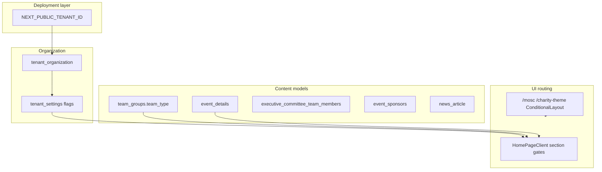
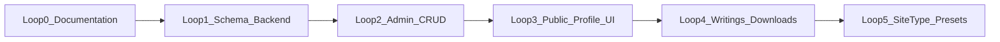

# Tenant Site Types and Personal Profile Website Support

## Executive summary

The application is **multi-tenant by `tenant_id`** but has **no first-class `siteType` / `tenantType`**. Differentiation today is **implicit**: homepage section toggles in [`tenant_settings`](code_html_template/SQLS/Current_Sqls/Event_Site_Manager_Latest_Schema.sql), sports/music rosters via [`team_groups.team_type`](code_html_template/SQLS/Current_Sqls/Event_Site_Manager_Latest_Schema.sql) (`SPORTS` | `MUSIC` | `OTHER`), leadership via [`executive_committee_team_members`](code_html_template/SQLS/Current_Sqls/Event_Site_Manager_Latest_Schema.sql), and alternate UIs by **route** (`/mosc`, `/charity-theme`)—not by stored tenant archetype.

**Personal profile websites are not supported as a product archetype.** Reusable pieces exist (bios, social URLs on committee/team rows; `news_article` with `author_id`; org documents) but there is no public portfolio model, achievements, personal downloads, or profile-themed homepage.

**Recommended default** (you skipped the architecture choice): **one tenant deployment = one person’s public site**, aligned with `NEXT_PUBLIC_TENANT_ID` per Amplify app. Multi-profile-per-tenant can be a later extension.

---

## How tenants are differentiated today



| Implied archetype | Signals today | Key files |
|-------------------|---------------|-----------|
| **Event organization** | `showEventsSectionInHomePage`, ticketing, sponsors | [`src/app/HomePageClient.tsx`](src/app/HomePageClient.tsx), [`documentation/HOMEPAGE_CONDITIONAL_SECTIONS.md`](documentation/HOMEPAGE_CONDITIONAL_SECTIONS.md) |
| **Sports / band tenant** | `showTeamMembersSectionInHomePage` + `team_groups` (`SPORTS`/`MUSIC`) | [`src/components/TeamSection.tsx`](src/components/TeamSection.tsx), admin team CRUD |
| **Leadership / church** | `showExecutiveCommitteeSectionInHomePage` | Executive committee admin + homepage section |
| **Membership org** | `isMembershipSubscriptionEnabled` | Membership flows |
| **Billing tier** | `tenant_organization.subscription_plan` | Not UX archetype |

**Frontend consumption**: [`TenantSettingsProvider.tsx`](src/components/TenantSettingsProvider.tsx) loads settings via `/api/proxy/tenant-settings`; homepage sections are boolean gates only—no `if (siteType === 'PROFILE')` branch exists.

**DTOs**: [`src/types/index.ts`](src/types/index.ts) — `TenantOrganizationDTO`, `TenantSettingsDTO` have no site-type field.

---

## Personal profile website: gap analysis

| Capability | What exists | Gap |
|------------|-------------|-----|
| **Identity / bio** | `user_profile` (auth), team/exec bios (org roster) | No **public** profile: slug, headline, long bio, photo, SEO, `is_public` |
| **Writings / articles** | `news_article` + categories in SQL; **no** proxy routes in this repo | Not wired to UI; not framed as portfolio; no “external newspaper link” type |
| **Downloadable works** | `official_document_*`, `event_media` | Org/church docs—not personal CV/papers with author linkage |
| **Achievements / timeline** | None | **New table** |
| **Community / affiliations** | Org name on `tenant_organization` only | **New table** (associations, boards, clubs) |
| **Social life / links** | Org URLs on `tenant_settings`; person URLs on exec committee | Not on `user_profile` or a dedicated public profile |
| **Homepage template** | Event-centric hero, events, sponsors | No writer/portfolio layout preset |
| **Admin** | Tenant settings, events, teams | No profile CMS module |

**Closest pattern to copy**: [`executive_committee_team_members`](code_html_template/SQLS/Current_Sqls/Event_Site_Manager_Latest_Schema.sql) (bio, image, linkedin/twitter/website) — but it is **multi-person org roster**, not a **single-subject portfolio site**.

---

## Online inspiration (writer / personal portfolio sites)

Common patterns from freelance writer and portfolio guidance (2025–2026):

- **5-page structure**: Home (positioning + CTA), Portfolio/Writings (3–6 samples), About (trust + photo), Contact, optional Blog/News
- **Home hero**: name, niche/tagline, primary CTA (“Read my work”, “Download CV”)
- **Publications strip**: logos or “As seen in …” with **external links** (newspapers, magazines)
- **Trust**: testimonials, awards, speaking/community blocks
- **Technical**: mobile-first, simple nav, fast load, clear contact

Use these as **UX acceptance criteria** for the `PERSONAL_PROFILE` template—not as a third-party theme dependency.

*(If “Humira” was a specific reference site, clarify in Loop 0; otherwise treat as general online portfolio research.)*

---

## Proposed product model

### 1. First-class site archetype

Add to **`tenant_organization`** (canonical identity):

```sql
site_type VARCHAR(32) NOT NULL DEFAULT 'EVENT_ORG'
  CHECK (site_type IN (
    'EVENT_ORG',
    'SPORTS_TEAM',
    'MUSIC_BAND',
    'CHURCH_ORG',
    'PERSONAL_PROFILE',
    'HYBRID'
  ));
```

Optional: `site_template_version` (varchar) for theme variants within a type.

**Template presets** (application layer, not DB): when admin selects `PERSONAL_PROFILE`, auto-set `tenant_settings`:

- `showEventsSectionInHomePage` = false (unless HYBRID)
- `showTeamMembersSectionInHomePage` = false
- `showExecutiveCommitteeSectionInHomePage` = false
- `showSponsorsSectionInHomePage` = false
- Enable new flags: `showProfileWritingsSection`, `showProfileAchievementsSection`, etc. (see below)

### 2. Public profile core (one row per tenant — default model)

**Table: `public_profile`** (1:1 with `tenant_id` for v1)

| Column | Purpose |
|--------|---------|
| `tenant_id` PK/FK | Multi-tenant scope |
| `display_name`, `tagline`, `headline` | Hero copy |
| `bio_html` or `bio_markdown` | Long about |
| `profile_image_url`, `cover_image_url` | Visual identity |
| `location`, `languages` | Optional metadata |
| `public_slug` | Optional vanity path `/profile/{slug}` |
| `contact_email`, `contact_form_enabled` | Contact |
| `linkedin_url`, `twitter_url`, `facebook_url`, `instagram_url`, `website_url`, `youtube_url` | Social |
| `cv_document_url` | Primary downloadable CV |
| `meta_title`, `meta_description` | SEO |
| `is_published` | Draft vs live |
| `created_at`, `updated_at` | Audit |

Link to `user_profile.id` **optionally** (`owner_user_profile_id`) for admin ownership—not required for public read.

### 3. Profile content tables

**`profile_writing`** — portfolio pieces and blog-like entries

- `title`, `slug`, `excerpt`, `body`, `featured_image_url`
- `writing_type`: `ORIGINAL`, `REPUBLISHED`, `EXTERNAL_LINK`
- `external_url`, `publication_name`, `published_at`, `status`, `display_order`
- Reuse patterns from `news_article` where possible; v1 can **migrate** or **alias** `news_article` → `profile_writing` in backend if you prefer one table (document decision in Loop 0 PRD).

**`profile_achievement`**

- `title`, `description`, `achievement_date`, `category` (AWARD, HONOR, SPEAKING, EDUCATION, OTHER), `issuer`, `url`, `display_order`, `is_featured`

**`profile_affiliation`** — community / boards / clubs

- `organization_name`, `role`, `description`, `start_date`, `end_date`, `logo_url`, `url`, `display_order`

**`profile_media_asset`** — downloadable files (papers, chapters, scans)

- `title`, `description`, `file_url`, `file_type`, `file_size_bytes`, `display_order`, `is_downloadable`, `requires_email` (optional gate)

All tables: `tenant_id` FK, indexes on `(tenant_id, display_order)`, standard `created_at`/`updated_at`.

### 4. Extend `tenant_settings` (homepage module flags)

Add booleans (mirror existing pattern in [`documentation/HOMEPAGE_CONDITIONAL_SECTIONS.md`](documentation/HOMEPAGE_CONDITIONAL_SECTIONS.md)):

- `showPublicProfileHeroSection`
- `showProfileWritingsSection`
- `showProfileAchievementsSection`
- `showProfileAffiliationsSection`
- `showProfileMediaDownloadsSection`
- `showProfileContactSection`

---

## Backend changes (`event-site-manager-service`)

This repo’s DDL lives in [`code_html_template/SQLS/Current_Sqls/Event_Site_Manager_Latest_Schema.sql`](code_html_template/SQLS/Current_Sqls/Event_Site_Manager_Latest_Schema.sql); **runtime API is the sibling Rust/Spring service** (not in `mosc-temp`).

Per existing layered PRD pattern ([`documentation/team_member/generic_prd.html`](documentation/team_member/generic_prd.html)):

1. **Liquibase/Flyway migrations** — new columns + tables above
2. **JPA/Rust entities + DTOs** — align with frontend [`src/types/index.ts`](src/types/index.ts)
3. **REST resources** (tenant-scoped criteria):
   - `GET/POST/PATCH/DELETE /api/public-profiles` (singleton by tenant)
   - `/api/profile-writings`, `/api/profile-achievements`, `/api/profile-affiliations`, `/api/profile-media-assets`
   - Extend `PATCH /api/tenant-organizations/{id}` for `site_type`
4. **Criteria filters**: `tenantId.equals`, `status.equals`, `slug.equals`, `sort=displayOrder,asc`
5. **Public read endpoints** (optional): unauthenticated GET by tenant for published profile only—if not, keep reads behind proxy JWT as today

---

## Frontend changes (`mosc-temp`)

### DTOs and proxy

- Add interfaces in [`src/types/index.ts`](src/types/index.ts)
- Add [`src/pages/api/proxy/public-profiles/[...slug].ts`](src/pages/api/proxy/) etc. using [`createProxyHandler`](src/lib/proxyHandler.ts)
- Admin CRUD in `src/app/admin/profile-site/ApiServerActions.ts` (server actions + `fetchWithJwtRetry`)

### Site-type awareness

- Extend `TenantOrganizationDTO` + admin org form ([`src/app/admin/tenant-management/`](src/app/admin/tenant-management/)) with **Site type** dropdown + preset application
- [`HomePageClient.tsx`](src/app/HomePageClient.tsx): branch on `site_type` or new settings flags to render **ProfileHomeSections** instead of events/sponsors
- New public route: `/about` or `/profile` (or root-only for single-page profile tenants)

### New UI components (profile template)

- `ProfileHeroSection`, `ProfileWritingsGrid`, `ProfileAchievementsTimeline`, `ProfileAffiliations`, `ProfileDownloads`, `ProfileContact`
- Follow [`mosc_styling_standards.mdc`](.cursor/rules/mosc_styling_standards.mdc) and existing media grid patterns

### Admin

- New admin hub tile (unique color per [`admin_home_button_groups_styling.mdc`](.cursor/rules/admin_home_button_groups_styling.mdc))
- CRUD lists/forms with validation per [`form_validation_styling.mdc`](.cursor/rules/form_validation_styling.mdc)

---

## Documentation deliverables (before build)

Create a layered PRD folder (mirror team_member / AdSense docs):

`documentation/tenant_management/personal_profile_site/`

| Document | Contents |
|----------|----------|
| `personal_profile_site_prd.html` | Goals, personas, site_type enum, template presets |
| `personal_profile_attribute_catalog.md` | Every field, validation, public vs admin, SEO |
| `personal_profile_database_schema.html` | ERD, migrations, reuse vs new tables |
| `personal_profile_backend_api.html` | Endpoints, DTOs, criteria |
| `personal_profile_frontend.html` | Routes, components, homepage matrix |
| `personal_profile_inspiration.html` | Writer portfolio patterns, section wireframes |
| `personal_profile_iterative_loops.html` | Loop engineering plan (below) |

---

## Iterative engineering loops (“loop mode”)

Each loop ships a **vertical slice** with acceptance criteria and docs update.



| Loop | Scope | Done when |
|------|--------|-----------|
| **0** | Attribute catalog + PRD + ERD sign-off | Stakeholders approve field list and `site_type` enum |
| **1** | DB migration + backend CRUD for `public_profile` + `site_type` on org | API smoke tests; DTOs in types |
| **2** | Admin: edit public profile + site type on org settings | Admin can publish draft profile |
| **3** | Public homepage/profile template (hero, about, contact, social) | `PERSONAL_PROFILE` tenant shows non-event homepage |
| **4** | Writings, achievements, affiliations, media assets (admin + public sections) | All catalog sections render with real data |
| **5** | Template presets + migrate one pilot tenant; optional `news_article` consolidation | Pilot tenant live; docs updated |

**Out of scope for v1** (document as future): multi-profile per tenant, comments on writings, newsletter, advanced analytics, custom domains beyond existing `satellite_domain`.

---

## Reuse vs build new

| Approach | Recommendation |
|----------|----------------|
| Reuse `news_article` for writings | **Defer merge** — add `profile_writing` in v1 for clearer semantics; map/import later |
| Reuse `executive_committee_team_members` for single person | **No** — wrong semantics (multi-person org) |
| Reuse `official_document` for downloads | **Partial** — prefer `profile_media_asset` with author-centric metadata |
| Reuse homepage flag pattern | **Yes** — extend `tenant_settings` |
| Reuse proxy/server-action patterns | **Yes** — per [`nextjs_api_routes.mdc`](.cursor/rules/nextjs_api_routes.mdc) |

---

## Risks and decisions to confirm later

1. **Tenancy model**: plan assumes **one public profile per tenant**; multi-profile needs `public_profile.tenant_id` + unique `slug` per person.
2. **`news_article`**: tables exist in SQL but **no frontend proxy** — either wire for church/news tenants or fold into profile writings in backend.
3. **Public API auth**: profile pages are public — ensure middleware `publicRoutes` includes new proxy paths if needed ([`src/middleware.ts`](src/middleware.ts)).
4. **Backend repo access**: migrations and REST must land in **event-site-manager-service** in parallel with this Next app.

---

## Suggested pilot

One `PERSONAL_PROFILE` tenant on a satellite domain: hero + 5 writings (mix of external links + PDF) + achievements + affiliations + contact — validates full loop before generalizing presets for `EVENT_ORG` / `SPORTS_TEAM`.
